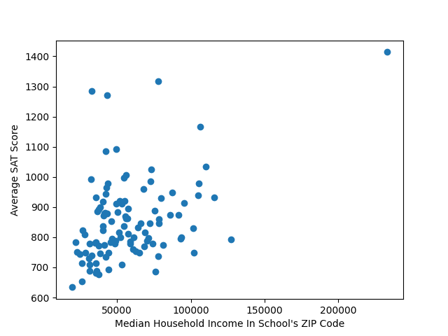

# Income vs SAT Scores
This analysis uses SAT data from New York City Schools to determine the effect of median household income in an area on the SAT scores. The way the analysis was done is:
- Obtain data relating scores to the school's DBN (District Borough Number)
- Convert the DBN into a ZIP code, using the school's address
- Use Census data to find the median household income for that ZIP code

## Results
Each point represents a school. The results of this analysis is here:

## Conclusions
There is a seemingly weak positive correlation between income and SAT scores for all aspects of the SAT (math, reading, total).
